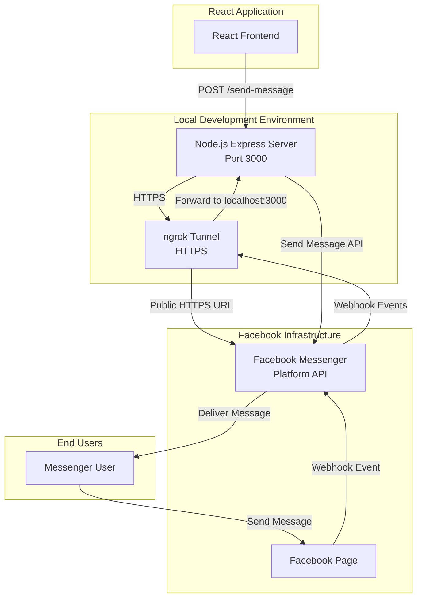
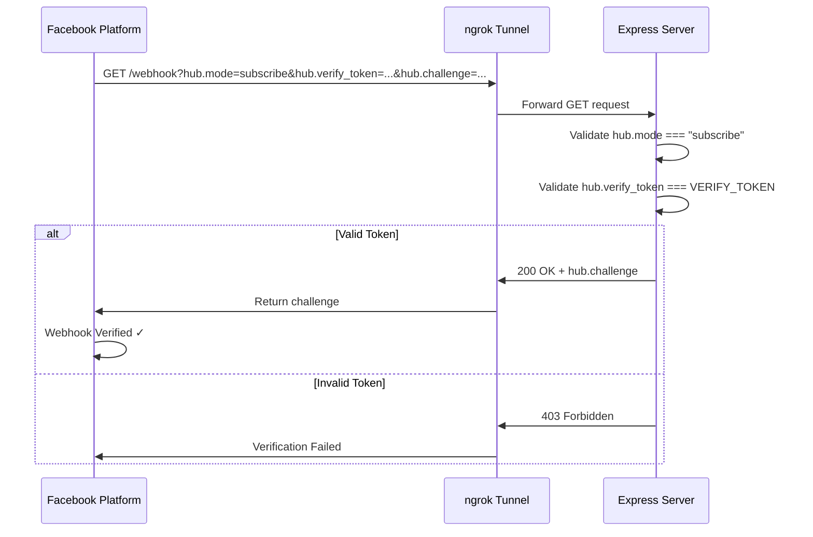
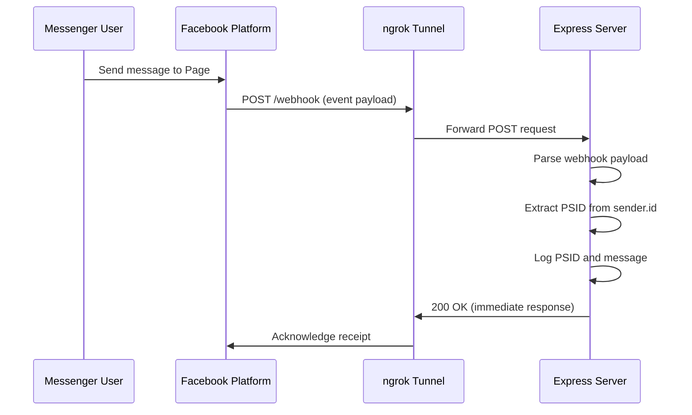
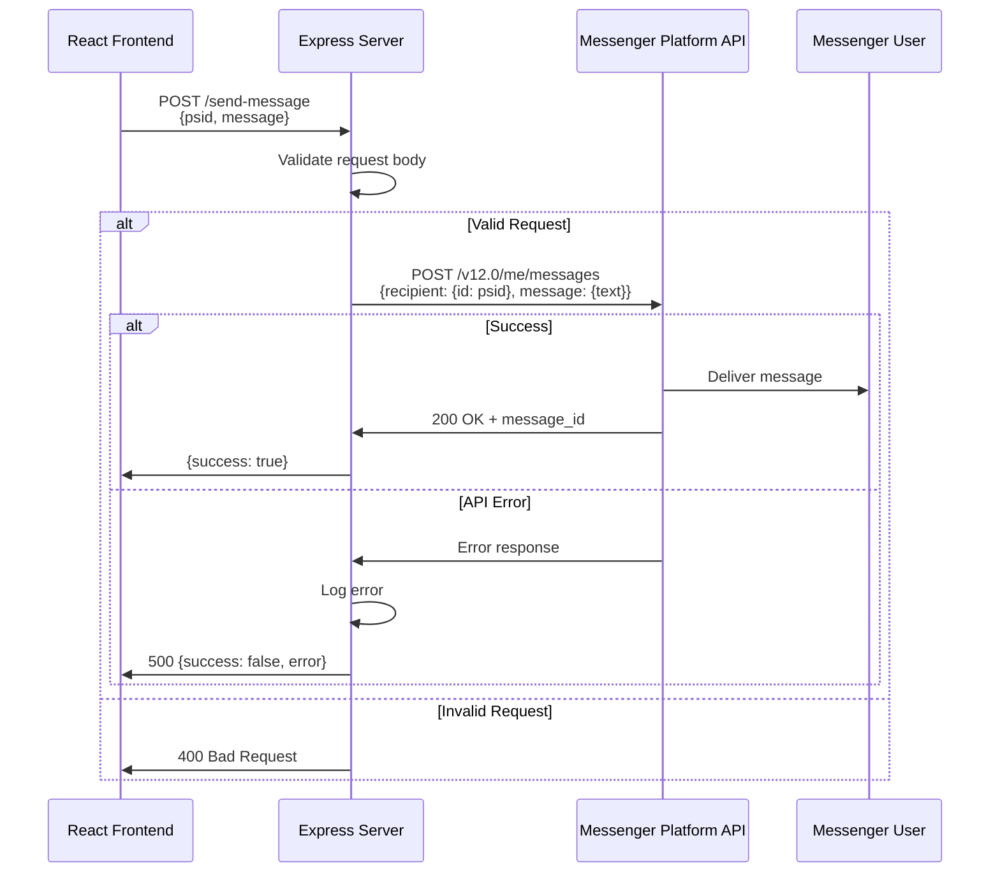

# Design Document: Messenger Notification Bridge

## Overview

The Messenger Notification Bridge is a backend integration system that enables a React web application to send notifications to users through Facebook Messenger. The system consists of three main components:

1. **Node.js Backend Server**: An Express-based server that handles webhook verification, receives Messenger events, and sends messages via the Facebook Messenger Platform API
2. **React Frontend Integration**: Client-side code that triggers message sending operations through the backend API
3. **ngrok Tunnel**: A secure tunnel service that exposes the local development server to the public internet, allowing Facebook to communicate with the webhook endpoints

The system follows a webhook-based architecture where Facebook sends real-time events to the backend server, and the React application can trigger outbound messages through a REST API. This design ensures compliance with Facebook Messenger Platform policies while providing a simple integration point for the existing React application.

### Key Design Principles

- **Separation of Concerns**: Backend handles all Messenger Platform API interactions; frontend focuses on UI and triggering notifications
- **Security**: Sensitive credentials managed through environment variables; webhook verification prevents unauthorized access
- **Simplicity**: Minimal dependencies; straightforward REST API for frontend integration
- **Compliance**: Adheres to Facebook Messenger Platform policies (only message users who have initiated contact)
- **Development-Friendly**: ngrok tunnel enables local development with external webhook integration

## Architecture

### High-Level Architecture



### Component Interaction Flow

#### Webhook Verification Flow


#### Message Reception Flow


#### Message Sending Flow


## Components and Interfaces

### Backend Server Components

#### 1. Express Application (`server.js`)

**Responsibilities:**
- Initialize Express server with middleware
- Define HTTP routes for webhook and message sending
- Load environment configuration
- Handle server lifecycle

**Dependencies:**
- `express`: Web framework
- `body-parser`: Request body parsing middleware
- `axios` or `node-fetch`: HTTP client for Messenger Platform API calls

**Configuration:**
```javascript
const express = require('express');
const bodyParser = require('body-parser');

const app = express();
const PORT = 3000;

// Middleware
app.use(bodyParser.json({ limit: '10mb' }));
app.use(bodyParser.urlencoded({ extended: true }));

// Environment variables
const PAGE_ACCESS_TOKEN = process.env.PAGE_ACCESS_TOKEN;
const VERIFY_TOKEN = process.env.VERIFY_TOKEN;
```

#### 2. Webhook Verification Endpoint

**Route:** `GET /webhook`

**Query Parameters:**
- `hub.mode`: Should be "subscribe"
- `hub.verify_token`: Must match configured VERIFY_TOKEN
- `hub.challenge`: Value to echo back on successful verification

**Response Codes:**
- `200`: Verification successful (returns hub.challenge)
- `403`: Verification failed (invalid token or mode)

**Implementation Pattern:**
```javascript
app.get('/webhook', (req, res) => {
  const mode = req.query['hub.mode'];
  const token = req.query['hub.verify_token'];
  const challenge = req.query['hub.challenge'];
  
  if (mode === 'subscribe' && token === VERIFY_TOKEN) {
    console.log('Webhook verified');
    res.status(200).send(challenge);
  } else {
    console.error('Webhook verification failed');
    res.sendStatus(403);
  }
});
```

#### 3. Webhook Event Receiver

**Route:** `POST /webhook`

**Request Body Structure:**
```json
{
  "object": "page",
  "entry": [
    {
      "id": "PAGE_ID",
      "time": 1234567890,
      "messaging": [
        {
          "sender": {
            "id": "USER_PSID"
          },
          "recipient": {
            "id": "PAGE_ID"
          },
          "timestamp": 1234567890,
          "message": {
            "mid": "MESSAGE_ID",
            "text": "Hello"
          }
        }
      ]
    }
  ]
}
```

**Processing Logic:**
1. Immediately respond with 200 OK (Facebook requires quick acknowledgment)
2. Check if `object === "page"`
3. Iterate through `entry` array
4. For each entry, iterate through `messaging` array
5. Extract `sender.id` (PSID) and log it
6. Extract `message.text` and log it

**Response Codes:**
- `200`: Always returned immediately

**Implementation Pattern:**
```javascript
app.post('/webhook', (req, res) => {
  const body = req.body;
  
  // Respond immediately
  res.status(200).send('EVENT_RECEIVED');
  
  // Process webhook payload
  if (body.object === 'page') {
    body.entry.forEach(entry => {
      entry.messaging.forEach(event => {
        const senderPsid = event.sender.id;
        console.log(`Received message from PSID: ${senderPsid}`);
        
        if (event.message && event.message.text) {
          console.log(`Message text: ${event.message.text}`);
        }
      });
    });
  }
});
```

#### 4. Message Sending Endpoint

**Route:** `POST /send-message`

**Request Body:**
```json
{
  "psid": "USER_PSID",
  "message": "Your notification message"
}
```

**Validation Rules:**
- `psid`: Required, non-empty string
- `message`: Required, non-empty string

**Messenger Platform API Call:**
- **URL:** `https://graph.facebook.com/v12.0/me/messages`
- **Method:** POST
- **Query Parameters:** `access_token=PAGE_ACCESS_TOKEN`
- **Headers:** `Content-Type: application/json`
- **Body:**
```json
{
  "recipient": {
    "id": "USER_PSID"
  },
  "message": {
    "text": "Your notification message"
  }
}
```

**Response Codes:**
- `200`: Message sent successfully
  ```json
  {
    "success": true,
    "messageId": "MESSAGE_ID"
  }
  ```
- `400`: Invalid request (missing psid or message)
  ```json
  {
    "success": false,
    "error": "Missing required field: psid"
  }
  ```
- `500`: Messenger Platform API error
  ```json
  {
    "success": false,
    "error": "Error message from Facebook API"
  }
  ```

**Implementation Pattern:**
```javascript
app.post('/send-message', async (req, res) => {
  const { psid, message } = req.body;
  
  // Validation
  if (!psid) {
    return res.status(400).json({ 
      success: false, 
      error: 'Missing required field: psid' 
    });
  }
  
  if (!message) {
    return res.status(400).json({ 
      success: false, 
      error: 'Missing required field: message' 
    });
  }
  
  // Log outgoing message
  console.log(`Sending message to PSID: ${psid}`);
  console.log(`Message content: ${message}`);
  
  try {
    const response = await axios.post(
      `https://graph.facebook.com/v12.0/me/messages`,
      {
        recipient: { id: psid },
        message: { text: message }
      },
      {
        params: { access_token: PAGE_ACCESS_TOKEN },
        headers: { 'Content-Type': 'application/json' }
      }
    );
    
    res.status(200).json({ 
      success: true, 
      messageId: response.data.message_id 
    });
  } catch (error) {
    console.error('Messenger API Error:', error.response?.data || error.message);
    res.status(500).json({ 
      success: false, 
      error: error.response?.data?.error?.message || 'Failed to send message' 
    });
  }
});
```

### React Frontend Integration

#### Message Sending Service

**File:** `src/services/messengerService.js`

**Purpose:** Encapsulate all Messenger-related API calls

**Implementation:**
```javascript
const BACKEND_URL = import.meta.env.VITE_BACKEND_URL || 'http://localhost:3000';

export const sendMessengerNotification = async (psid, message) => {
  try {
    const response = await fetch(`${BACKEND_URL}/send-message`, {
      method: 'POST',
      headers: {
        'Content-Type': 'application/json',
      },
      body: JSON.stringify({ psid, message }),
    });
    
    const data = await response.json();
    
    if (!response.ok) {
      throw new Error(data.error || 'Failed to send message');
    }
    
    return data;
  } catch (error) {
    console.error('Error sending Messenger notification:', error);
    throw error;
  }
};
```

#### React Component Integration Example

**Usage in React Components:**
```javascript
import { sendMessengerNotification } from '../services/messengerService';

const NotificationButton = ({ userPsid }) => {
  const [loading, setLoading] = useState(false);
  const [error, setError] = useState(null);
  const [success, setSuccess] = useState(false);
  
  const handleSendNotification = async () => {
    setLoading(true);
    setError(null);
    setSuccess(false);
    
    try {
      await sendMessengerNotification(
        userPsid, 
        'Your order has been processed!'
      );
      setSuccess(true);
    } catch (err) {
      setError(err.message);
    } finally {
      setLoading(false);
    }
  };
  
  return (
    <div>
      <button onClick={handleSendNotification} disabled={loading}>
        {loading ? 'Sending...' : 'Send Notification'}
      </button>
      {success && <p>Notification sent successfully!</p>}
      {error && <p>Error: {error}</p>}
    </div>
  );
};
```

### ngrok Tunnel Configuration

**Purpose:** Expose local development server to public internet for Facebook webhook integration

**Setup Commands:**
```bash
# Install ngrok (if not already installed)
# Download from https://ngrok.com/download

# Start ngrok tunnel
ngrok http 3000
```

**Expected Output:**
```
Session Status                online
Account                       user@example.com
Version                       3.x.x
Region                        United States (us)
Forwarding                    https://abc123.ngrok.io -> http://localhost:3000
```

**Configuration Notes:**
- The HTTPS URL (e.g., `https://abc123.ngrok.io`) must be used in Facebook webhook configuration
- The tunnel remains active as long as the ngrok process is running
- Free tier provides random subdomain; paid tier allows custom subdomains
- Tunnel URL changes each time ngrok restarts (free tier)

## Data Models

### Webhook Event Payload

**Structure received from Facebook:**
```typescript
interface WebhookPayload {
  object: 'page';
  entry: Array<{
    id: string;           // Page ID
    time: number;         // Timestamp
    messaging: Array<{
      sender: {
        id: string;       // User PSID
      };
      recipient: {
        id: string;       // Page ID
      };
      timestamp: number;
      message?: {
        mid: string;      // Message ID
        text?: string;    // Message text
      };
      postback?: {
        title: string;
        payload: string;
      };
    }>;
  }>;
}
```

### Message Send Request

**Structure sent from React frontend to backend:**
```typescript
interface SendMessageRequest {
  psid: string;           // Required: User's Page-Scoped ID
  message: string;        // Required: Message text to send
}
```

### Message Send Response

**Success response:**
```typescript
interface SendMessageSuccess {
  success: true;
  messageId: string;      // Facebook's message ID
}
```

**Error response:**
```typescript
interface SendMessageError {
  success: false;
  error: string;          // Error description
}
```

### Messenger Platform API Request

**Structure sent to Facebook API:**
```typescript
interface MessengerSendRequest {
  recipient: {
    id: string;           // User PSID
  };
  message: {
    text: string;         // Message content
  };
}
```

### Environment Configuration

**Required environment variables:**
```typescript
interface EnvironmentConfig {
  // Backend (.env file)
  PAGE_ACCESS_TOKEN: string;    // Facebook Page Access Token
  VERIFY_TOKEN: string;         // Webhook verification token
  PORT?: number;                // Server port (default: 3000)
  
  // Frontend (.env.local)
  VITE_BACKEND_URL?: string;    // Backend URL (default: http://localhost:3000)
}
```

## Error Handling

### Backend Error Handling Strategy

#### 1. Environment Configuration Errors

**Scenario:** Missing required environment variables

**Handling:**
```javascript
// At server startup
if (!PAGE_ACCESS_TOKEN) {
  console.error('ERROR: PAGE_ACCESS_TOKEN environment variable is not set');
  process.exit(1);
}

if (!VERIFY_TOKEN) {
  console.error('ERROR: VERIFY_TOKEN environment variable is not set');
  process.exit(1);
}
```

**Rationale:** Fail fast at startup rather than encountering errors during runtime

#### 2. Webhook Verification Errors

**Scenario:** Invalid verification token or mode

**Handling:**
- Log the verification attempt with details
- Return 403 Forbidden status
- Do not expose internal error details to external caller

```javascript
if (mode !== 'subscribe' || token !== VERIFY_TOKEN) {
  console.error('Webhook verification failed:', {
    receivedMode: mode,
    tokenMatch: token === VERIFY_TOKEN
  });
  return res.sendStatus(403);
}
```

#### 3. Webhook Event Processing Errors

**Scenario:** Malformed webhook payload

**Handling:**
- Always respond with 200 OK first (Facebook requirement)
- Wrap processing logic in try-catch
- Log errors without failing the request

```javascript
app.post('/webhook', (req, res) => {
  res.status(200).send('EVENT_RECEIVED');
  
  try {
    if (body.object === 'page') {
      // Process events
    }
  } catch (error) {
    console.error('Error processing webhook event:', error);
    // Don't throw - already responded to Facebook
  }
});
```

#### 4. Message Sending Validation Errors

**Scenario:** Missing or invalid request parameters

**Handling:**
- Validate before making external API call
- Return 400 Bad Request with descriptive error
- Log validation failures

```javascript
if (!psid || typeof psid !== 'string' || psid.trim() === '') {
  console.error('Validation error: Invalid or missing psid');
  return res.status(400).json({
    success: false,
    error: 'Missing required field: psid'
  });
}
```

#### 5. Messenger Platform API Errors

**Scenario:** Facebook API returns error (invalid PSID, rate limit, etc.)

**Handling:**
- Catch HTTP errors from API client
- Extract error details from Facebook's response
- Log complete error for debugging
- Return 500 with sanitized error message to frontend

```javascript
try {
  const response = await axios.post(/* ... */);
  // Success handling
} catch (error) {
  const fbError = error.response?.data?.error;
  
  console.error('Messenger API Error:', {
    message: fbError?.message,
    type: fbError?.type,
    code: fbError?.code,
    fbtrace_id: fbError?.fbtrace_id
  });
  
  res.status(500).json({
    success: false,
    error: fbError?.message || 'Failed to send message'
  });
}
```

**Common Facebook API Errors:**
- `(#100)` Invalid PSID or user has not messaged the page
- `(#4)` Rate limit exceeded
- `(#200)` Insufficient permissions
- `(#190)` Invalid access token

#### 6. Request Body Parsing Errors

**Scenario:** Invalid JSON or oversized payload

**Handling:**
- body-parser middleware handles parsing errors automatically
- Configure size limits
- Add error handling middleware

```javascript
app.use(bodyParser.json({ 
  limit: '10mb',
  strict: true 
}));

// Error handling middleware
app.use((err, req, res, next) => {
  if (err instanceof SyntaxError && err.status === 400 && 'body' in err) {
    console.error('JSON parsing error:', err.message);
    return res.status(400).json({ 
      success: false, 
      error: 'Invalid JSON in request body' 
    });
  }
  
  if (err.type === 'entity.too.large') {
    console.error('Request body too large');
    return res.status(413).json({ 
      success: false, 
      error: 'Request body exceeds size limit' 
    });
  }
  
  next(err);
});
```

### Frontend Error Handling Strategy

#### 1. Network Errors

**Scenario:** Backend server unreachable

**Handling:**
```javascript
try {
  const response = await fetch(/* ... */);
  // ...
} catch (error) {
  if (error.name === 'TypeError' && error.message.includes('fetch')) {
    // Network error
    console.error('Network error: Unable to reach backend server');
    throw new Error('Unable to connect to notification service. Please check your connection.');
  }
  throw error;
}
```

#### 2. HTTP Error Responses

**Scenario:** Backend returns 4xx or 5xx status

**Handling:**
```javascript
const response = await fetch(/* ... */);

if (!response.ok) {
  const data = await response.json();
  
  if (response.status === 400) {
    throw new Error(`Invalid request: ${data.error}`);
  } else if (response.status === 500) {
    throw new Error(`Server error: ${data.error}`);
  } else {
    throw new Error(`Unexpected error: ${response.status}`);
  }
}
```

#### 3. User Feedback

**Scenario:** Display errors to users

**Handling:**
- Use React state to manage error messages
- Display user-friendly error messages
- Provide retry mechanisms where appropriate

```javascript
const [error, setError] = useState(null);

// In error handler
setError('Failed to send notification. Please try again.');

// In render
{error && (
  <div className="error-message">
    {error}
    <button onClick={handleRetry}>Retry</button>
  </div>
)}
```

### Logging Strategy

**Log Levels and Content:**

1. **Startup Logs:**
   - Server listening port
   - Environment variable status (loaded/missing)
   - ngrok tunnel URL

2. **Webhook Logs:**
   - Verification attempts (success/failure)
   - Received events with PSID and message preview
   - Processing errors

3. **Message Sending Logs:**
   - Outgoing message details (PSID, message content)
   - API response status
   - Error details from Facebook API

4. **Error Logs:**
   - Full error stack traces
   - Request context (headers, body)
   - Facebook API error codes and trace IDs

**Log Format Example:**
```javascript
console.log(`[${new Date().toISOString()}] [INFO] Server listening on port ${PORT}`);
console.log(`[${new Date().toISOString()}] [INFO] Received message from PSID: ${psid}`);
console.error(`[${new Date().toISOString()}] [ERROR] Messenger API Error:`, errorDetails);
```

## Testing Strategy

### Unit Testing

**Focus Areas:**
1. **Request Validation Logic**
   - Test validation functions for psid and message fields
   - Test edge cases: empty strings, null values, whitespace-only strings
   - Test type validation (ensure strings, not numbers or objects)

2. **Webhook Verification Logic**
   - Test with valid mode and token
   - Test with invalid mode
   - Test with invalid token
   - Test with missing parameters

3. **Error Response Formatting**
   - Test error response structure matches expected format
   - Test error message extraction from Facebook API responses

**Example Unit Tests:**
```javascript
describe('Request Validation', () => {
  test('should reject missing psid', () => {
    const result = validateSendMessageRequest({ message: 'test' });
    expect(result.valid).toBe(false);
    expect(result.error).toContain('psid');
  });
  
  test('should reject empty message', () => {
    const result = validateSendMessageRequest({ psid: '123', message: '' });
    expect(result.valid).toBe(false);
    expect(result.error).toContain('message');
  });
  
  test('should accept valid request', () => {
    const result = validateSendMessageRequest({ 
      psid: '123', 
      message: 'Hello' 
    });
    expect(result.valid).toBe(true);
  });
});
```

### Integration Testing

**Focus Areas:**
1. **Webhook Endpoint Integration**
   - Test GET /webhook with valid verification parameters
   - Test GET /webhook with invalid parameters
   - Test POST /webhook with sample Facebook payload
   - Verify 200 OK response is immediate

2. **Message Sending Endpoint Integration**
   - Test POST /send-message with valid data (using mock Facebook API)
   - Test POST /send-message with invalid data
   - Test error handling when Facebook API returns errors
   - Verify correct API call structure to Facebook

3. **End-to-End Flow**
   - Test complete flow: webhook event → log PSID → send message
   - Use mock Facebook API to avoid external dependencies
   - Verify logging output

**Mock Strategy:**
- Use `nock` or `msw` to mock Facebook Messenger Platform API
- Mock successful responses and various error scenarios
- Verify request structure sent to Facebook API

**Example Integration Test:**
```javascript
describe('POST /send-message', () => {
  beforeEach(() => {
    // Mock Facebook API
    nock('https://graph.facebook.com')
      .post('/v12.0/me/messages')
      .query({ access_token: 'test_token' })
      .reply(200, { message_id: 'mid.123' });
  });
  
  test('should send message successfully', async () => {
    const response = await request(app)
      .post('/send-message')
      .send({ psid: '123456', message: 'Test message' })
      .expect(200);
    
    expect(response.body.success).toBe(true);
    expect(response.body.messageId).toBe('mid.123');
  });
  
  test('should return 400 for missing psid', async () => {
    const response = await request(app)
      .post('/send-message')
      .send({ message: 'Test message' })
      .expect(400);
    
    expect(response.body.success).toBe(false);
    expect(response.body.error).toContain('psid');
  });
});
```

### Manual Testing

**Webhook Verification:**
1. Start backend server
2. Start ngrok tunnel
3. Configure Facebook webhook with ngrok URL
4. Verify Facebook shows "Verified" status

**Message Reception:**
1. Send message to Facebook Page from Messenger
2. Verify backend logs show received PSID and message
3. Verify webhook returns 200 OK immediately

**Message Sending:**
1. Use Postman or curl to send POST request to /send-message
2. Verify message appears in Messenger
3. Test with invalid PSID and verify error handling
4. Test with missing fields and verify validation errors

**Frontend Integration:**
1. Integrate message sending button in React component
2. Click button and verify message is sent
3. Verify success/error feedback is displayed
4. Test network error scenarios (stop backend server)

### Testing Tools

**Recommended Tools:**
- **Jest**: Unit and integration testing framework
- **Supertest**: HTTP assertion library for testing Express routes
- **nock** or **msw**: HTTP mocking for Facebook API calls
- **Postman**: Manual API testing
- **ngrok**: Webhook testing with Facebook

**Test Coverage Goals:**
- Unit tests: 80%+ coverage of validation and utility functions
- Integration tests: All API endpoints covered
- Error scenarios: All error paths tested

### Property-Based Testing Assessment

**PBT is NOT appropriate for this feature** because:

1. **Infrastructure and External Services**: The feature primarily involves HTTP endpoint configuration, webhook handling, and integration with Facebook's external API. These are infrastructure concerns, not pure logic.

2. **Deterministic Behavior**: Webhook verification is deterministic (token matches or doesn't). Message sending either succeeds or fails based on external service state, not input variation.

3. **High Cost of Iteration**: Testing with the real Facebook API would require 100+ external API calls, which is expensive and slow. While mocks could be used, the value of 100 iterations vs. 2-3 representative examples is minimal.

4. **No Universal Properties**: There are no meaningful universal properties to test. For example:
   - "For any valid PSID, sending a message succeeds" - This depends on Facebook's state (user must have messaged the page first), not our code's logic
   - "For any webhook payload, we extract the PSID" - This is simple parsing logic better tested with specific examples

**Alternative Testing Approach:**
- **Unit tests** for validation logic (specific examples and edge cases)
- **Integration tests** with mocked Facebook API (2-3 representative scenarios per endpoint)
- **Manual testing** with real Facebook integration for end-to-end verification

This approach provides comprehensive coverage without the overhead of property-based testing, which is better suited for pure functions with complex input spaces and universal invariants.

