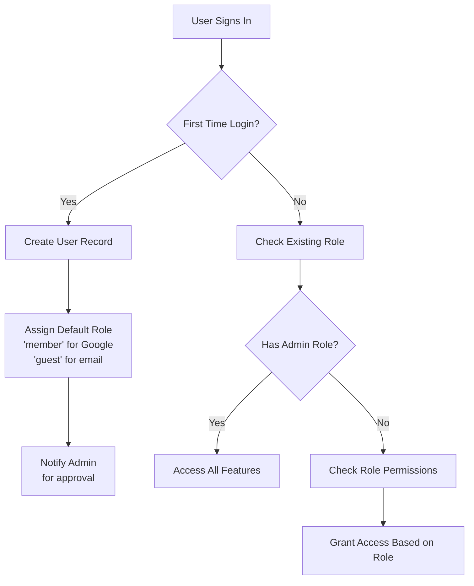

# Database Schema: User Management and Role System

## Users Collection Schema (`users/{userId}`)

### User Document Structure
```javascript
{
  // Basic Information
  "uid": "string",                    // Firebase Auth UID
  "email": "string",                  // User's email address
  "name": "string",                   // Display name
  "photoURL": "string",               // Profile photo URL (Google/Facebook)
  
  // Role and Permissions
  "role": "string",                   // 'admin', 'secretary', 'representative', 'member', 'guest'
  "permissions": {
    "canManageProducts": "boolean",   // Can manage products
    "canManageOrders": "boolean",     // Can manage orders
    "canManageUsers": "boolean",      // Can manage users (admin only)
    "canViewAnalytics": "boolean",    // Can view analytics
    "canExportData": "boolean",       // Can export data
    "canSendNotifications": "boolean" // Can send notifications
  },
  
  // Authentication Information
  "provider": "string",               // 'google', 'email', 'facebook'
  "isEmailVerified": "boolean",       // Email verification status
  "isActive": "boolean",              // Account active status
  
  // Timestamps
  "createdAt": "timestamp",           // Account creation date
  "lastLoginAt": "timestamp",         // Last login timestamp
  "lastUpdatedAt": "timestamp",       // Last profile update
  
  // Additional Information
  "department": "string",              // Department/Organization (optional)
  "phone": "string",                   // Phone number (optional)
  "address": "string",                 // Address (optional)
  "notes": "string"                    // Admin notes about user
}
```

## Roles and Permissions Matrix

### 1. **Admin** (Full System Access)
- **Description**: Full system administrator with all privileges
- **Permissions**:
  - Can manage all products and inventory
  - Can view and manage all orders
  - Can manage users and assign roles
  - Can access all analytics and reports
  - Can export all data
  - Can send system notifications
  - Can configure system settings

### 2. **Secretary** (Office Management)
- **Description**: Office secretary with elevated permissions
- **Permissions**:
  - Can manage products and inventory
  - Can process and manage orders
  - Can view member lists
  - Can access basic analytics
  - Can export order data
  - Can send notifications to members
  - Cannot manage users or system settings

### 3. **Representative** (Department Representative)
- **Description**: Department representative with specific department access
- **Permissions**:
  - Can view products
  - Can place orders for department
  - Can view department-specific analytics
  - Can view member lists
  - Cannot manage users or products
  - Cannot access system-wide data

### 4. **Member** (Basic User - Default for Google Sign-In)
- **Description**: Regular member with basic access
- **Permissions**:
  - Can view products
  - Can place personal orders
  - Can view own order history
  - Can update personal profile
  - Cannot access admin features
  - Cannot view other users' data

### 5. **Guest** (Restricted Access)
- **Description**: Temporary or limited access users
- **Permissions**:
  - Can view public information only
  - Cannot place orders
  - Cannot access member features
  - Account requires admin approval for upgrade

## Role Assignment Flow



## Default Permissions Configuration

### For Email Sign-Up Users (Default: 'guest')
```javascript
{
  role: 'guest',
  permissions: {
    canManageProducts: false,
    canManageOrders: false,
    canManageUsers: false,
    canViewAnalytics: false,
    canExportData: false,
    canSendNotifications: false
  }
}
```

### For Google Sign-In Users (Default: 'member')
```javascript
{
  role: 'member',
  permissions: {
    canManageProducts: false,
    canManageOrders: false,
    canManageUsers: false,
    canViewAnalytics: false,
    canExportData: false,
    canSendNotifications: false
  }
}
```

### For Admin-Created Users (Assigned by admin)
```javascript
{
  role: 'admin' | 'secretary' | 'representative' | 'member' | 'guest',
  permissions: {
    canManageProducts: true/false,
    canManageOrders: true/false,
    canManageUsers: true/false,
    canViewAnalytics: true/false,
    canExportData: true/false,
    canSendNotifications: true/false
  }
}
```

## Database Security Rules

```javascript
rules_version = '2';
service cloud.firestore {
  match /databases/{database}/documents {
    // Users can read their own data
    match /users/{userId} {
      allow read: if request.auth != null && request.auth.uid == userId;
      allow write: if request.auth != null && 
        (
          // Users can update their own profile
          request.auth.uid == userId &&
          // But only specific fields
          request.resource.data.keys().hasAll(['name', 'department', 'phone', 'address'])
        ) || 
        // Admins can manage all user data
        get(/databases/$(database)/documents/users/$(request.auth.uid)).data.role == 'admin';
    }
    
    // Public read access for active products
    match /products/{productId} {
      allow read: if true;
      allow write: if request.auth != null &&
        get(/databases/$(database)/documents/users/$(request.auth.uid)).data.role in ['admin', 'secretary'];
    }
    
    // Orders - users can create, admins/secretaries can manage
    match /orders/{orderId} {
      allow create: if request.auth != null;
      allow read: if request.auth != null &&
        (
          // Users can read their own orders
          resource.data.userId == request.auth.uid ||
          // Admins/secretaries can read all orders
          get(/databases/$(database)/documents/users/$(request.auth.uid)).data.role in ['admin', 'secretary']
        );
      allow update, delete: if request.auth != null &&
        get(/databases/$(database)/documents/users/$(request.auth.uid)).data.role in ['admin', 'secretary'];
    }
  }
}
```

## User Management API Endpoints

### 1. Get User Profile
```
GET /api/users/:userId
- Returns user profile data
- Only accessible by user themselves or admin
```

### 2. Update User Role (Admin Only)
```
PUT /api/users/:userId/role
Body: { "role": "new_role", "permissions": {...} }
- Updates user role and permissions
- Requires admin privileges
- Logs the change in audit trail
```

### 3. List Users (Admin Only)
```
GET /api/users
Query params: ?role=admin&page=1&limit=20
- Returns paginated list of users
- Filterable by role, department, active status
```

### 4. Search Users (Admin Only)
```
GET /api/users/search
Query params: ?q=search_term&field=name|email
- Searches users by name, email, or department
```

## Audit Trail Collection (`audit_logs/{logId}`)

```javascript
{
  "action": "string",                 // 'role_change', 'login', 'profile_update'
  "userId": "string",                 // User who performed action
  "targetUserId": "string",           // User who was affected (if applicable)
  "changes": {
    "before": "object",               // Data before change
    "after": "object"                 // Data after change
  },
  "timestamp": "timestamp",           // When action occurred
  "ipAddress": "string",              // IP address of request
  "userAgent": "string",              // Browser/device info
  "notes": "string"                   // Additional notes
}
```

## Implementation Notes

### 1. **Default Role Assignment**
- Email sign-up: 'guest' (requires admin approval)
- Google sign-in: 'member' (default access)
- Facebook sign-in: 'member' (if implemented)
- Admin-created: Custom role assignment

### 2. **Role Upgrade Requests**
- Users can request role upgrades
- Requests are logged in audit trail
- Admins review and approve/reject requests
- Notifications sent to user upon decision

### 3. **Security Considerations**
- Always validate role changes server-side
- Implement rate limiting for authentication
- Log all admin actions for accountability
- Use secure session management
- Regular security audits recommended

### 4. **Performance Optimizations**
- Index users collection on email and role fields
- Cache frequently accessed user data
- Implement pagination for user lists
- Use Firestore composite indexes for complex queries

## Migration Script (for existing users)

```javascript
// Run this once to initialize permissions for existing users
const migrateUsers = async () => {
  const usersSnapshot = await db.collection('users').get();
  
  for (const doc of usersSnapshot.docs) {
    const userData = doc.data();
    
    // Initialize permissions if not exists
    if (!userData.permissions) {
      const defaultPermissions = {
        canManageProducts: userData.role === 'admin' || userData.role === 'secretary',
        canManageOrders: userData.role === 'admin' || userData.role === 'secretary',
        canManageUsers: userData.role === 'admin',
        canViewAnalytics: userData.role === 'admin' || userData.role === 'secretary',
        canExportData: userData.role === 'admin' || userData.role === 'secretary',
        canSendNotifications: userData.role === 'admin' || userData.role === 'secretary'
      };
      
      await doc.ref.update({
        permissions: defaultPermissions,
        lastUpdatedAt: new Date()
      });
    }
  }
};
```